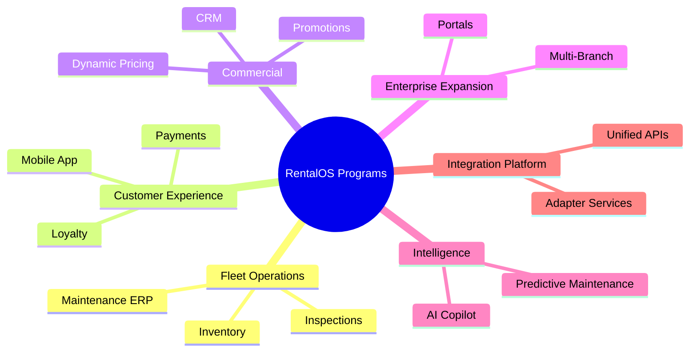
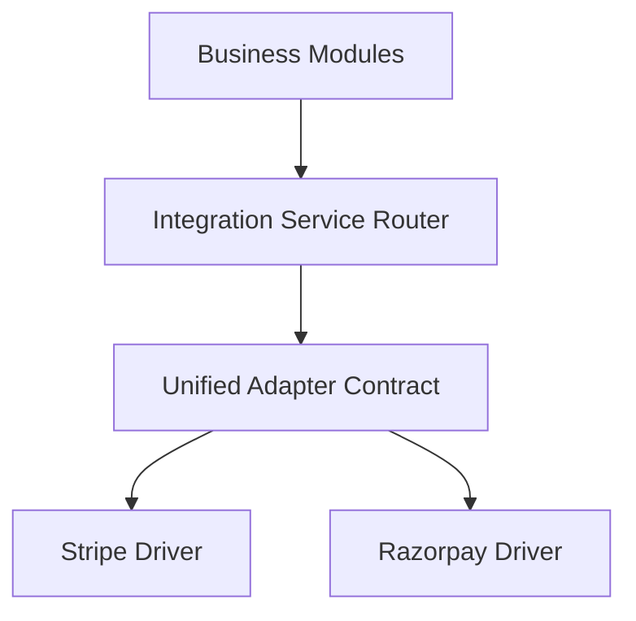

# 3M Car Rentals Integration Platform & Business Programs
**Unified Integration Gateway Interfaces, Decoupled Adapter Specs, and Cross-Program Operational Mappings**

*Prepared by: Head of Platform Engineering & VP of Product*

---

## Part 1: The Six Business Programs Framework



### Program 1: Fleet Operations
* **Scope**: Maximize vehicle uptime, physical tracking, and maintenance.
* **Component Projects**: Maintenance ERP, Vehicle Inspection, Damage Assessment, Parts Inventory, Workshop Management, Preventive Maintenance, and Vehicle Lifecycle management.

### Program 2: Customer Experience (CX)
* **Scope**: Client onboarding, digital signatures, transactions, and user retention.
* **Component Projects**: Customer Mobile App, Digital Rental Agreements, Wallet, Payments, Loyalty points, Customer Support desk, and Trip Management.

### Program 3: Commercial
* **Scope**: Yield optimization, marketing automation, and dynamic pricing models.
* **Component Projects**: Dynamic Pricing Rules, Promotions, Coupon Engine, Revenue Optimization models, Sales CRM, and Marketing Automation.

### Program 4: Enterprise Expansion
* **Scope**: Regional expansion, branch operations, and vendor management.
* **Component Projects**: Multi-Branch setup, Multi-City databases, Vendor Portal, Driver Portal, Cleaning Portal, and Workshop Portal.

### Program 5: Intelligence
* **Scope**: Machine learning models, predictive alerts, and Copilot interfaces.
* **Component Projects**: Predictive Maintenance forecasts, Demand Forecasting, Executive Dashboard, AI Operations Copilot, Revenue Prediction, and Fleet Optimization algorithms.

### Program 6: Integration Platform
* **Scope**: Vendor isolation layer providing unified APIs, failover, and retry loggers.
* **Component Projects**: Gateway Integrations (Payments, SMS, WhatsApp, GPS, Accounting, ID Verification).

---

## Part 2: Integration Platform Architecture & Specifications

The Integration Platform isolates third-party API dependencies behind an abstract adapter layer. If a vendor changes (e.g., swapping Stripe for Cashfree), only the driver file changes; downstream business logic is unaffected.



### 1. Payment Gateway Adapter Contract
Downstream code communicates with the payment gateway using a unified transaction request interface:

```typescript
export interface ChargeRequest {
  transactionId: string;
  amount: number;
  currency: string;
  recipientEmail: string;
  metadata: Record<string, string>;
}

export interface ChargeResponse {
  success: boolean;
  gatewayTransactionId: string;
  paymentStatus: "authorized" | "captured" | "failed" | "refunded";
  errorCode?: string;
}

export abstract class PaymentGatewayAdapter {
  abstract charge(request: ChargeRequest): Promise<ChargeResponse>;
  abstract refund(gatewayTransactionId: string, amount: number): Promise<ChargeResponse>;
}
```

### 2. Messaging Gateway Adapter Contract (WhatsApp, Email, SMS)
Aggregates channels under a single payload configuration:

```typescript
export interface MessageRequest {
  recipient: string; // Phone number or Email
  channel: "WhatsApp" | "SMS" | "Email";
  templateId: string;
  variables: Record<string, string>;
}

export interface MessageResponse {
  success: boolean;
  deliveryId: string;
  errorMessage?: string;
}

export abstract class MessagingAdapter {
  abstract sendMessage(request: MessageRequest): Promise<MessageResponse>;
}
```

### 3. Telematics & GPS Adapter Contract
Centralizes tracking inputs from multiple OBD-II vehicle devices (Geotab, Teltonika):

```typescript
export interface VehicleCoordinates {
  latitude: number;
  longitude: number;
  speedKmh: number;
  fuelPercentage: number;
  odometerKm: number;
  engineStatus: "running" | "stopped" | "idle";
}

export abstract class TelematicsAdapter {
  abstract fetchLocation(vehicleId: string): Promise<VehicleCoordinates>;
}
```

### 4. Identity & Driving License Verification Gateway
Standardises KYC background verification queries:

```typescript
export interface KYCRequest {
  licenseNumber: string;
  country: string;
  fullName: string;
  dateOfBirth: string;
}

export interface KYCResponse {
  verified: boolean;
  matchScore: number; // 0 to 100
  failureReason?: string;
}

export abstract class IdentityVerificationAdapter {
  abstract verifyDriverLicense(request: KYCRequest): Promise<KYCResponse>;
}
```

---

## Part 3: Operational Governance & Resiliency

To prevent third-party outages from blocking core workflows:
1. **Exponential Backoff Retries**: Integration calls use the shared `http_client` with default retry parameters (3 retry limits).
2. **Circuit Breaker Pattern**: If a vendor API fails repeatedly (e.g. 5 times in 1 minute), the breaker trips, returning a graceful fallback cache page.
3. **Audit Trail Logging**: Every external API transaction is logged to the PostgreSQL `audit_logs` table detailing request parameters and latency metrics.
