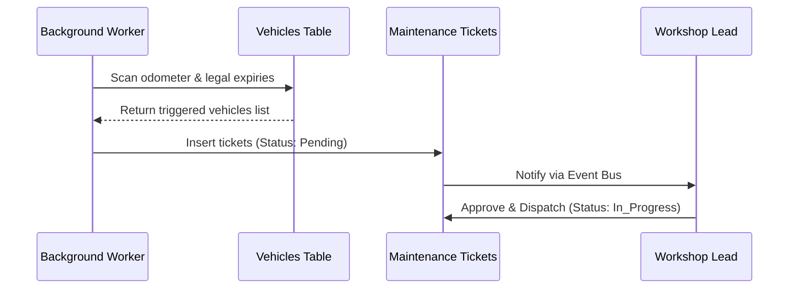
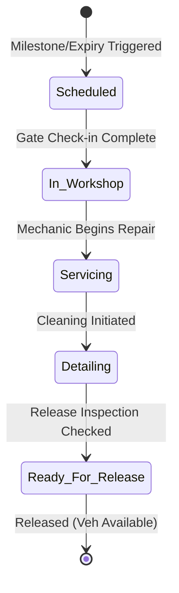
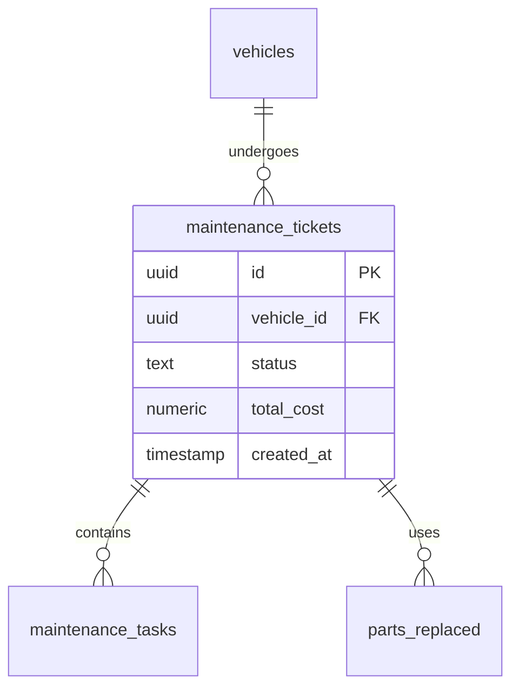

# 3M Car Rentals Maintenance Management ERP
**Comprehensive Product Discovery, System Design, & Technical Specifications Manual**

*Prepared by: Product & Engineering Leadership*

---

## 1. Business Requirements Document (BRD)
* **Objective**: Automate and standardize the vehicle maintenance lifecycle across multiple cities to maximize fleet utilization, minimize unscheduled downtime, and ensure safety compliance.
* **Scope**: Support active scheduling, dispatching, and tracking for a fleet of 10,000+ vehicles across regional branches.
* **Key Metrics**:
  * Reduce fleet downtime from 8.5% to < 4.0%.
  * Eliminate regulatory non-compliance issues (expired PUC, insurance, or RC).
  * Automate service alerts based on odometer thresholds and duration triggers.

---

## 2. Product Requirements Document (PRD)
* **Functional Requirements**:
  * **Auto-Trigger Scheduler**: Service events trigger automatically based on mileage increments (every 10,000 KM) or duration limits (e.g. 1 year).
  * **Workshop Portal**: Workshop staff can log repair details, record parts replaced, and upload invoices.
  * **Inspector Checklist**: Inspectors perform gate checks upon arrival and release.
* **Non-Functional Requirements**:
  * Region-based routing of maintenance slots.
  * High availability to support offline-first logging for mechanics.

---

## 3. Technical Requirements Document (TRD)
* **Architectural Layer**: Next.js App Router API endpoints communicating with PostgreSQL via Supabase.
* **Worker Queue Integration**: Integrates with the `Background Worker` queue to poll expirities daily and append maintenance tickets.
* **Realtime Sync**: Leverages PostgreSQL listen/notify triggers to broadcast ticket state updates to the Operations Swimlanes board.

---

## 4. User Personas
1. **Prakash (Workshop Lead, Mumbai)**: Needs to quickly assign tickets to mechanics, track active work-in-progress cars, and record maintenance costs.
2. **Karan (Operations Manager)**: Needs high-level overview of total units in service bays to adjust booking availability.
3. **Anjali (Cleaner/Inspector)**: Needs mobile-friendly check-in checklists to review car state when entering workshop.

---

## 5. User Stories
* **US-101**: *As a Fleet Manager, I want vehicles to be automatically flagged for maintenance when their odometer passes threshold milestones, so that we prevent engine wear.*
* **US-102**: *As a Workshop Lead, I want to approve repair details and log expenses so that the finance team can audit budgets.*
* **US-103**: *As a Cleaner, I want to complete interior wash tasks so that the vehicle availability resets to active status.*

---

## 6. Use Case Diagrams

```mermaid
leftToRightDirection
actor "Workshop Lead" as WL
actor "Inspector" as IN
actor "Background Worker" as BW

rectangle "Maintenance ERP" {
  WL --> (Create Ticket)
  WL --> (Log Maintenance Cost)
  IN --> (Complete Gate Checklist)
  BW --> (Auto-schedule Expiry Checks)
}
```

---

## 7. Business Process Flows



---

## 8. State Machine Definitions



---

## 9. Entity Relationship Diagram



---

## 10. Database Schema Design

```sql
-- DDL for Maintenance ERP Subsystem

CREATE TYPE public.maintenance_status AS ENUM (
    'scheduled', 'in_workshop', 'servicing', 'detailing', 'ready_for_release', 'completed'
);

CREATE TABLE IF NOT EXISTS public.maintenance_tickets (
    id uuid PRIMARY KEY DEFAULT gen_random_uuid(),
    vehicle_id uuid NOT NULL REFERENCES public.vehicles(id) ON DELETE RESTRICT,
    status public.maintenance_status DEFAULT 'scheduled'::public.maintenance_status NOT NULL,
    trigger_type text NOT NULL, -- 'odometer', 'duration', 'incident', 'expiry'
    reported_odometer integer NOT NULL,
    total_cost numeric(10, 2) DEFAULT 0.00 NOT NULL,
    scheduled_date date NOT NULL,
    completion_date timestamp with time zone,
    created_at timestamp with time zone DEFAULT timezone('utc'::text, now()) NOT NULL,
    updated_at timestamp with time zone DEFAULT timezone('utc'::text, now()) NOT NULL
);

CREATE TABLE IF NOT EXISTS public.maintenance_tasks (
    id uuid PRIMARY KEY DEFAULT gen_random_uuid(),
    ticket_id uuid NOT NULL REFERENCES public.maintenance_tickets(id) ON DELETE CASCADE,
    task_name text NOT NULL,
    notes text,
    is_completed boolean DEFAULT false NOT NULL,
    completed_by uuid REFERENCES public.users(id)
);
```

---

## 11. API Specification
* **`POST /api/admin/maintenance/tickets`**: Creates a ticket.
* **`GET /api/admin/maintenance/tickets?status=servicing`**: Retrieves list.
* **`PATCH /api/admin/maintenance/tickets/:id/transition`**: Performs status transitions.

---

## 12. UI/UX Wireframe Specification
* **Command Board**: Left sidebar filters, main grid columns representing Swimlanes (`Scheduled`, `In Workshop`, `Servicing`, `Detailing`, `Ready to Release`).
* **Interaction**: Clicking card opens right-sliding `<Drawer>` detailing check-lists and parts billing items.

---

## 13. Component Breakdown
* **`<MaintenanceCommandBoard>`**: Outer wrapper containing the Board state.
* **`<SwimlaneColumn>`**: Individual lanes.
* **`<TicketCard>`**: Compact info card representing vehicle, odometer, and trigger reason.

---

## 14. Folder Structure
```text
src/
└── app/
    ├── admin/
    │   └── maintenance/       # Maintenance Dashboard layout
    └── api/
        └── admin/
            └── maintenance/   # API transaction gateways
```

---

## 15. Service Layer Design
Create `src/services/maintenance.service.ts` containing:
* `createTicket(payload: TicketCreateInput)`
* `transitionStatus(ticketId: string, status: string, verifier: string)`
* `completeTask(taskId: string, verifier: string)`

---

## 16. Domain Event Definitions
Published to `DomainEventDispatcher` event bus:
* **`MaintenanceScheduled`**: Published on auto-scheduler trigger.
* **`VehicleEnteredWorkshop`**: Published on gate check-in.
* **`MaintenanceCompleted`**: Published on final release checklist confirmation.

---

## 17. Notification Matrix
* **`MaintenanceScheduled`**:
  * Channels: Slack (`#fleet-operations`), In-App (to Branch Managers).
* **`MaintenanceCompleted`**:
  * Channels: In-App, Slack (triggering availability status update).

---

## 18. RBAC Permission Matrix
* **Workshop Lead**: Read/Write tickets, transition statuses, approve costs.
* **Inspector**: Complete check-in/out checklists.
* **Cleaner**: Mark detailing tasks complete.
* **Driver / Customer**: No access (fails Edge middleware gates).

---

## 19. Validation Rules
* **Odometer Checks**: Mileage must be positive and greater than or equal to current vehicle odometer record.
* **Cost Limits**: Logged cost values must be non-negative.

---

## 20. Audit Logging Strategy
Every state transition or cost approval logs to the central `audit_logs` table via `AuditService.logAudit()` tracking `oldValue` (e.g. `status: "servicing"`) and `newValue` (e.g. `status: "detailing"`).

---

## 21. Performance Requirements
* **Latency**: All Swimlanes query endpoints must return in < 150ms.
* **Indexing**: Composite index on `maintenance_tickets(vehicle_id, status)`.

---

## 22. Security Requirements
* **Authorization**: Gated via edge middleware using `requireStaff()`.
* **RLS**: Row-Level Security checks that users belong to matching branches.

---

## 23. Testing Strategy
* **Unit Tests**: Mock ticket service state transition boundaries.
* **Integration Tests**: Verify database triggers auto-update vehicle status to `maintenance` when ticket status changes to `in_workshop`.

---

## 24. Acceptance Criteria
* **AC-1**: When the vehicle status transitions to `maintenance`, the vehicle must be automatically hidden from customer booking pages.
* **AC-2**: When the final release checklist is verified, the vehicle status must automatically reset to `available`.

---

## 25. Production Rollout Plan
* **Phase 1**: Enable auto-scheduler background check on a subset of 100 staging vehicles.
* **Phase 2**: Provision regional workshop accounts and execute schema migrations.
* **Phase 3**: Roll out globally to all cities.
