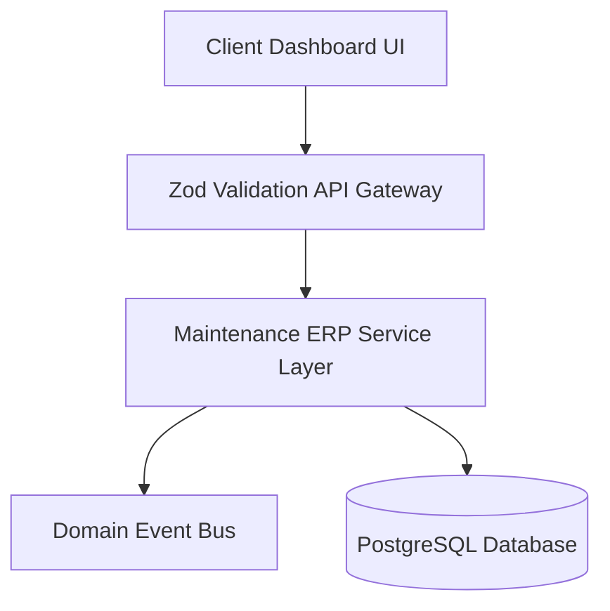
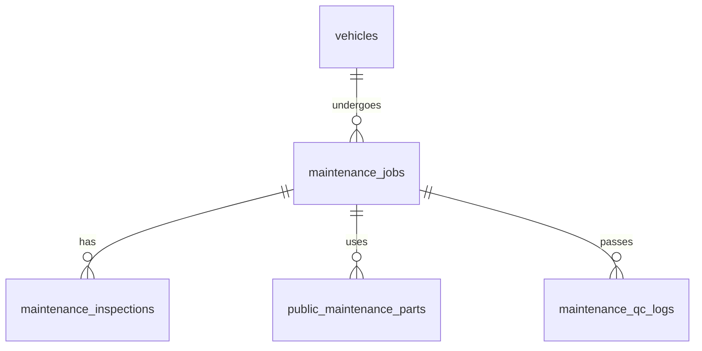
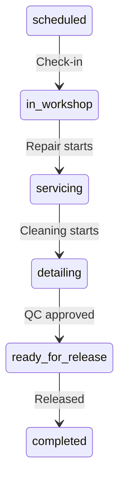

# Release 1.2 Maintenance ERP Subsystem
## Engineering Design Specification (EDS)

---

## 1. Overview
This Engineering Design Specification (EDS) defines the technical and operational blueprint for the **Maintenance ERP Subsystem (Release 1.2)** of the RentalOS platform. It coordinates the lifecycle of active vehicles entering, undergoing, and leaving servicing across multiple regional branches.

---

## 2. Goals
* **Automate Work Orders Creation**: Transition vehicle status to maintenance automatically upon triggers.
* **Granular Tracking**: Manage tasks, parts, costs, and technician assignments.
* **Integrity Audits**: Lock vehicles under maintenance to prevent client reservations.
* **Zero Downtime Migration**: Roll out database schemas and indexes without service interruption.

---

## 3. Functional Scope
The scope encompasses parts logging, mechanic checklists, safety inspections, budget controls, and final cleaning tasks.

---

## 4. Architecture Overview
Downstream components follow the modular layers defined in the RentalOS playbook:



---

## 5. Sprint 1 – Database & Maintenance Engine

### Business Objective
Track vehicle maintenance records in database tables and automate work order generation.

### User Stories
* **Story PMO-101**: As a Fleet Manager, I want vehicles to be automatically flagged for maintenance when they reach mileage limits.

### Database Schema
```sql
CREATE TYPE public.maintenance_job_priority AS ENUM ('low', 'medium', 'high', 'critical');
CREATE TYPE public.maintenance_job_status AS ENUM (
    'scheduled', 'in_workshop', 'servicing', 'detailing', 'ready_for_release', 'completed', 'cancelled'
);

CREATE TABLE public.maintenance_jobs (
    id uuid PRIMARY KEY DEFAULT gen_random_uuid(),
    vehicle_id uuid NOT NULL REFERENCES public.vehicles(id) ON DELETE RESTRICT,
    job_number text UNIQUE NOT NULL,
    trigger_type text NOT NULL, -- 'mileage', 'incident', 'duration', 'manual'
    priority public.maintenance_job_priority DEFAULT 'medium'::public.maintenance_job_priority NOT NULL,
    status public.maintenance_job_status DEFAULT 'scheduled'::public.maintenance_job_status NOT NULL,
    assigned_to uuid REFERENCES public.users(id) ON DELETE SET NULL,
    estimated_cost numeric(10, 2) DEFAULT 0.00 NOT NULL,
    actual_cost numeric(10, 2) DEFAULT 0.00 NOT NULL,
    created_at timestamptz DEFAULT now() NOT NULL,
    completed_at timestamptz
);

CREATE INDEX idx_maintenance_jobs_vehicle ON public.maintenance_jobs(vehicle_id);
CREATE INDEX idx_maintenance_jobs_status ON public.maintenance_jobs(status);
```

### API Design
* `POST /api/admin/maintenance/jobs`: Creates a job ticket.
* `GET /api/admin/maintenance/jobs`: Retrieves filtered lists.

### Services
* `MaintenanceService.createJob(payload: CreateJobInput)`: Validates active status and inserts records.

### Domain Events
* `MaintenanceCreated`: Published on ticket insertion.

### UI Layout
* A wizard overlay with a dropdown selector for vehicles, trigger types, and priorities.

### Validation Rules & Edge Cases
* **Validation**: Vehicle ID must exist; priority must be a valid enum value.
* **Edge Case**: If the vehicle is already in an active maintenance job, the creation request is rejected.

### QA Verification Checklist
* [ ] Verify table creations in PostgreSQL database.
* [ ] Verify job number generator logic is read-only.

---

## 6. Sprint 2 – Maintenance Job List

### Business Objective
Allow operators to view, search, and filter all active and historical maintenance jobs.

### User Stories
* **Story PMO-102**: As an Operations Coordinator, I want to filter maintenance tickets by branch and status so I can see what vehicles are off-road.

### API Design
* `GET /api/admin/maintenance/jobs?status=servicing&priority=critical`: Retrieves filtered logs.

### Services
* `MaintenanceService.listJobs(filters: JobFiltersInput)`: Dynamic query compiler.

### UI Component Hierarchy
```text
<MaintenanceDashboardLayout>
  ├── <FilterBar> (Filters by Status, Workshop, Priority)
  └── <Table> (Columns: Job Number, Vehicle, Priority, Status, Cost)
```

### Validation Rules & Edge Cases
* **Validation**: Filter query limits must not exceed 100 rows per call.
* **Edge Case**: If a searched registration number does not exist, an empty list state is returned.

### QA Verification Checklist
* [ ] Verify debounced inputs do not trigger multiple server queries.

---

## 7. Sprint 3 – Maintenance Details Workspace

### Business Objective
Provide a unified workspace displaying vehicle logs, task lists, parts, and costs.

### User Stories
* **Story PMO-103**: As a Workshop Lead, I want a single workspace detailing a car's repair history.

### UI Component Hierarchy
```text
<MaintenanceDetailsWorkspace>
  ├── <VehicleOverviewCard>
  ├── <Timeline> (Audit logs)
  └── <TasksGrid> (List of checklists items)
```

### QA Verification Checklist
* [ ] Verify that all related files and PDF invoices are downloadable.

---

## 8. Sprint 4 – Vehicle Inspection Module

### Business Objective
Capture structured visual and physical checklist details upon arrival at the workshop.

### Database Schema
```sql
CREATE TABLE public.maintenance_inspections (
    id uuid PRIMARY KEY DEFAULT gen_random_uuid(),
    job_id uuid NOT NULL REFERENCES public.maintenance_jobs(id) ON DELETE CASCADE,
    inspector_id uuid NOT NULL REFERENCES public.users(id) ON DELETE RESTRICT,
    exterior_status text NOT NULL,
    interior_status text NOT NULL,
    mechanical_status text NOT NULL,
    checklist jsonb NOT NULL,
    created_at timestamptz DEFAULT now()
);
```

### API Design
* `POST /api/admin/maintenance/inspections`: Submits gate checklist results.

### Services
* `InspectionService.logInspection(payload: LogInspectionInput)`: Records checklist results and triggers alerts.

### Domain Events
* `InspectionCompleted`: Published upon verification check completion.

### Validation Rules & Edge Cases
* **Validation**: Checklists JSON must contain keys for exterior, interior, and mechanical areas.
* **Edge Case**: Reject submission if the job is not in `scheduled` status.

### QA Verification Checklist
* [ ] Verify that checklist JSON validation triggers failures on missing keys.

---

## 9. Sprint 5 – Repair Workflow Engine

### Business Objective
Enforce valid status transitions across the repair lifecycle.

### API Design
* `PATCH /api/admin/maintenance/jobs/:id/status`: Transitions status.

### Services
* `WorkflowService.transition(jobId: string, status: string)`: Validates transition rules.

### State Transitions Validation Rules
* Valid transitions: `scheduled` ➔ `in_workshop` ➔ `servicing` ➔ `detailing` ➔ `ready_for_release` ➔ `completed`.
* Rejections: Direct jumps (e.g. `scheduled` ➔ `completed`) are blocked.

### QA Verification Checklist
* [ ] Verify that invalid state jumps return a validation error.

---

## 10. Sprint 6 – Parts & Cost Management

### Business Objective
Track parts used, vendor sources, invoice attachments, and cost logs.

### Database Schema
```sql
CREATE TABLE public.maintenance_parts (
    id uuid PRIMARY KEY DEFAULT gen_random_uuid(),
    job_id uuid NOT NULL REFERENCES public.maintenance_jobs(id) ON DELETE CASCADE,
    part_name text NOT NULL,
    part_type text NOT NULL, -- 'oem', 'aftermarket'
    vendor_name text NOT NULL,
    cost numeric(10, 2) NOT NULL,
    quantity integer DEFAULT 1 NOT NULL,
    warranty_months integer DEFAULT 0 NOT NULL,
    invoice_url text,
    created_at timestamptz DEFAULT now()
);
```

### Services
* `PartsService.addPart(payload: AddPartInput)`: Logs a part and auto-increments the job's `actual_cost` column.

### Domain Events
* `PartsAdded`: Triggers budget limit alerts.

### QA Verification Checklist
* [ ] Verify that adding a part updates the job's actual cost field automatically.

---

## 11. Sprint 7 – Quality Assurance Module

### Business Objective
Ensure the vehicle undergoes safety road tests before returning to the rental fleet.

### Database Schema
```sql
CREATE TABLE public.maintenance_qc_logs (
    id uuid PRIMARY KEY DEFAULT gen_random_uuid(),
    job_id uuid NOT NULL REFERENCES public.maintenance_jobs(id) ON DELETE CASCADE,
    tester_id uuid NOT NULL REFERENCES public.users(id) ON DELETE RESTRICT,
    road_test_passed boolean DEFAULT false NOT NULL,
    brakes_passed boolean DEFAULT false NOT NULL,
    engine_passed boolean DEFAULT false NOT NULL,
    checklist jsonb NOT NULL,
    notes text,
    created_at timestamptz DEFAULT now()
);
```

### Services
* `QCService.submitQC(payload: submitQCInput)`: Transitions status to `ready_for_release`.

### Validation Rules
* Cannot transition to `ready_for_release` or `completed` unless all checklist values are marked passed.

### QA Verification Checklist
* [ ] Verify that the system blocks releasing a vehicle if any check fails.

---

## 12. Sprint 8 – Domain Events

### Domain Events Schema Mappings

| Event Name | Trigger Source | Payload |
| :--- | :--- | :--- |
| **`MaintenanceCreated`** | `MaintenanceService.createJob` | `jobId, vehicleId, triggerType` |
| **`RepairStarted`** | `WorkflowService.transition` | `jobId, vehicleId, timestamp` |
| **`MaintenanceCompleted`**| `WorkflowService.transition` | `jobId, vehicleId, actualCost` |

---

## 13. Sprint 9 – Notification Framework

### Central Notification Routing

* **`MaintenanceCreated`**:
  * Channels: In-App, Slack (`#fleet-operations`).
* **`MaintenanceCompleted`**:
  * Channels: In-App, Slack (`#operations-coordination`).
* **Cost Limit Exceeded Alerts**:
  * If `actual_cost` > $1,000, trigger direct notification to the Finance Manager.

---

## 14. Sprint 10 – Audit & Compliance

Every action inside the Maintenance ERP logs to `audit_logs` using `AuditService.logAudit()`:
* **Log Fields**: `userEmail`, `action` (e.g. `qc_submit`), `entity` (`maintenance_qc_logs`), `oldValue`, `newValue`.

---

## 15. Security & RBAC Matrix

| Role | Create Job | Log Inspection | Log Parts / Cost | Complete QC | Close Job |
| :--- | :---: | :---: | :---: | :---: | :---: |
| **Fleet Manager** | ✅ | ❌ | ❌ | ❌ | ✅ |
| **Workshop Lead** | ✅ | ✅ | ✅ | ❌ | ✅ |
| **Technician** | ❌ | ❌ | ✅ | ❌ | ❌ |
| **Inspector** | ❌ | ✅ | ❌ | ✅ | ❌ |

---

## 16. API Contracts

* **`POST /api/admin/maintenance/jobs`**:
  * Request Body: `{ vehicleId: string, triggerType: string, priority: string }`
  * Response: `{ success: true, data: { jobId: string, jobNumber: string } }`

---

## 17. Database ER Diagram



---

## 18. UI Wireframes

* **Dashboard View**: Sidebar navigation leads to `/admin/maintenance`, rendering a grid header followed by a paginated dataset table.
* **Transitions**: Side drawers slide open upon selecting items.

---

## 19. State Machines



---

## 20. Testing Strategy
* **Unit**: Test status transition validators.
* **Integration**: Verify database triggers auto-update vehicle status to `maintenance` when ticket status is `in_workshop`.

---

## 21. Definition of Done (DoD)
Release 1.2 is signed off and production-ready only when:
* [ ] Database migration tables are created.
* [ ] Dynamic validation rules block invalid transitions.
* [ ] Domain events publish to the event bus.
* [ ] Automated and manual tests pass.
* [ ] Audit trails log all state updates.
