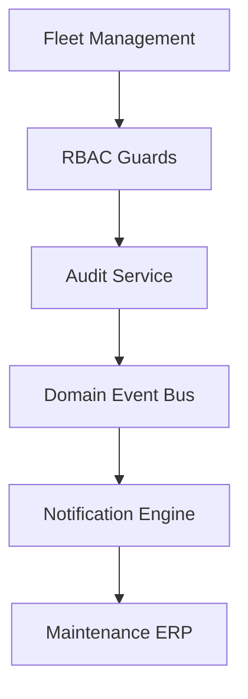

# 3M Car Rentals Master PMO Delivery Plan
**Enterprise Product Roadmap, Release Engineering Schedules, and Quality Assurance Specifications**

*Prepared by: Head of Program Management & VP of Engineering*

---

## 1. Product Roadmap

| Version | Sprint | Deliverable | Status |
| :--- | :--- | :--- | :--- |
| **v1.0** | Sprint 0 | Platform Foundation (Auth, UI design components, DB tables) | ✅ Completed |
| **v1.1** | Sprint 1 | Platform Stabilization (Refactoring layouts, lint fixes, standard validations) | ✅ Completed |
| **v1.2** | Sprint 2 | Maintenance ERP (Workshops portal, cost tracking, maintenance logs) | ⏳ In-Discovery |
| **v1.3** | Sprint 3 | Mobile-first Vehicle Inspection System (Damages log, fuel check-in checklists) | ⏳ Backlog |
| **v1.4** | Sprint 4 | Operations Dispatch Planning (Swimlanes command board checkout workflow) | ⏳ Backlog |
| **v1.5** | Sprint 5 | Dynamic Pricing System (Holiday spikes, season multipliers scheduler) | ⏳ Backlog |
| **v2.0** | Sprint 6 | Multi-Branch Regional Scalability (Cross-branch resource scheduling) | ⏳ Backlog |

---

## 2. Maintenance ERP Epic Hierarchy

### Epic 1: Workshop Dashboard
Unified command view of active repair requests, service bay occupation rates, and local branch maintenance backlogs.

### Epic 2: Work Orders Subsystem
Creation, updates, and status transitions tracking (`scheduled` ➔ `in_workshop` ➔ `servicing`).

### Epic 3: Preventive Maintenance Scheduler
Automatic scheduling triggers based on odometer milestones (every 10k KM) or days since last service.

### Epic 4: Vendor & Detailing Management
External detailing shop allocations, scheduling washing lanes, and tracking completion signatures.

### Epic 5: Parts Inventory Management
Parts item catalogue, unit costs tracking, and serial numbers tracking for safety compliance.

### Epic 6: Financial Analytics
Servicing costs logs, budget thresholds verification, and parts cost audits.

### Epic 7: Real-time Operations Notifications
Asynchronous email and SMS alert queues notifying managers when a vehicle enters or exits a workshop.

### Epic 8: Operations Audits Ledger
Centralized database logging of every state mutation or cost override in the `audit_logs` table.

---

## 3. User Story Backlog (Epic 2: Work Orders Sample)

### Story ID: PMO-201
* **User Story**: As a Fleet Manager, I want to create a work order ticket for a vehicle so that repairs can begin.
* **Acceptance Criteria**:
  * **Given** a vehicle exists in the database.
  * **When** a Fleet Manager submits the creation payload with vehicle ID and odometer.
  * **Then** a new maintenance ticket is generated, status is set to `scheduled`, and the vehicle's availability status is updated.
* **Metadata**:
  * **Priority**: High | **Story Points**: 3 | **Dependencies**: R-101 (Database Schema) | **DoD**: Standard DoD.

---

## 4. Sprint Planning (Sprint 2 Detail)

* **Objective**: Fully implement the database tables, API handlers, and UI command board for Maintenance ERP.
* **Target Stories**: PMO-201 (Work order creation), PMO-202 (Status transition API), PMO-203 (Workshop swimlanes board).
* **Risks**: Delays in database migration execution blocking API testing.
* **Exit Criteria**: All test suites pass, API responses conform to `{ data, meta }`, and the code compiles with 0 warnings.

---

## 5. Subsystem Dependency Matrix

---

## 6. Risk Register

| Risk ID | Description | Likelihood | Impact | Mitigation Strategy | Owner |
| :--- | :--- | :--- | :--- | :--- | :--- |
| **R-1** | Database Bloat on Audit Logs | High | Medium | range partition the `audit_logs` table by month | Lead DBA |
| **R-2** | Notification Queue Delays | Medium | High | Implement local in-memory retries with exponential backoffs | Backend Lead |
| **R-3** | Unauthorized Status Transitions | Low | High | Enforce permission checks (`rbac.can`) on all API gateways | Security Architect |

---

## 7. Release Calendar (v1.2 Timeline)

* **Week 1**: Implement PostgreSQL schema tables, triggers, and migrations.
* **Week 2**: Build backend `MaintenanceService` service layer and validation schemas.
* **Week 3**: Implement API route handlers (`/api/admin/maintenance/tickets`).
* **Week 4**: Construct the frontend `<MaintenanceCommandBoard>` swimlanes layout.
* **Week 5**: Conduct integration testing, edge-case validation, and security sweeps.
* **Week 6**: Execute production deployment and rollout.

---

## 8. Quality Assurance (QA) Matrix

* **Unit Tests**:
  * Verify `maintenance.service.ts` correctly processes status transitions.
  * Verify Zod schemas validate odometer and cost fields.
* **Integration Tests**:
  * Verify PostgreSQL trigger updates the `vehicles.availability_status` column.
  * Verify that audit logs are correctly written to the database.
* **End-to-End Tests**:
  * Simulate a vehicle trigger ➔ Workshop lead schedules service ➔ Mechanic transitions state ➔ Cleaner marks clean ➔ Vehicle is marked available.

---

## 9. Engineering KPI Dashboard

* **Velocity**: Target of 35 story points per sprint.
* **Bug Count**: < 2 high-severity bugs open at any time.
* **Lead Time**: < 4 days from branch creation to production merge.
* **Build Success**: > 98% pass rate on GitHub Actions runner.
* **Deployment Frequency**: Weekly releases to production.

---

## 10. Production Gates Checklist

Before deploying Sprint 2 to production, the release coordinator must verify:
* [ ] Database migration files (`.sql`) have been successfully executed.
* [ ] Rollback and backup processes are verified.
* [ ] API endpoints conform to the `{ data, meta }` response shape.
* [ ] The project compiles successfully (`npm run build`).
* [ ] Permissions gates restrict access to authorized roles.
* [ ] Error logs are verified and piping to monitoring dashboards.
